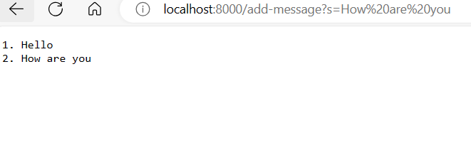
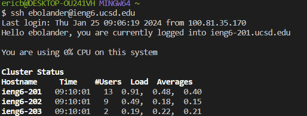

# Lab Report 2 
## Code for my String Server: 

import java.io.IOException;
import java.net.URI;

import java.io.IOException;
import java.net.URI;
import java.util.ArrayList;
import java.util.List;

class StringHandler implements URLHandler {
  private List<String> messages = new ArrayList<>();
  private int num = 0;

  public String handleRequest(URI url) {
    if (url.getPath().equals("/add-message")) {
      String[] params = url.getQuery().split("=");
      if (params[0].equals("s")) {
        num += 1;
        String message = num + ". " + params[1];
        messages.add(message);
        return String.join("\n", messages);
      }
      return "404 Not Found!";
    }
    return "";
  }
}

* ## ``` The handlerequest method is called. ```
* ## ``` A single argument which is the URI representing the URL ```
* ## ```The num field is incremented for each request and it represents the amount of messages added. ``
  
  
  ## Screenshots of my String Server: 
  

  
 ## Path to Public Key:
## ``` /Users``` ```/ericb ``` ```/.ssh ``` ``` /id_rsa.pub ```

## Path to Private Key: 
  ## ``` /.sssh ``` ``` /authorized_keys ```
  ## Screenshot of Terminal interaction without password: 
 


  **Something I learned in Week 2/3 that I didn't know before**
  * I learned a lot about paths and how to navigate different commands.
  * I also learned how to use commands to double check that I am in the right place.
  * I also learned how to login to a remote terminal and copy files from one to another. 
  
