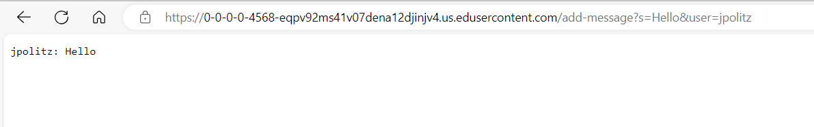
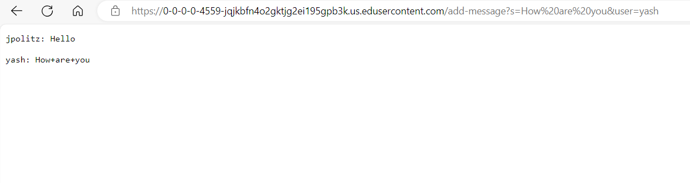
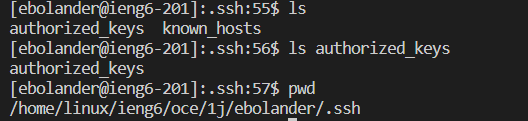
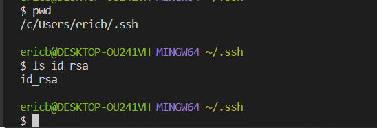

# Lab Report 2 
# Eric Bolander
# Dr. Politz

## Code for my Chat Server: 
```
import java.io.IOException;
import java.net.URI;

    class ChatHandler implements URLHandler {
  String chatHistory = "";

  public String handleRequest(URI url) {

    // expect /add-message?s=<string>&user=<name>
    if (url.getPath().equals("/add-message")) {
        String[] params = url.getQuery().split("&");
        String[] MessageInput = params[0].split("=");
        String[] UserInput = params[1].split("=");
      
      if (MessageInput[0].equals("s") && UserInput[0].equals("user")) {
        String user = UserInput[1];
        String message = MessageInput[1];
        this.chatHistory += user + ": " + message + "\n\n";
        return this.chatHistory;
      } else {
        return "Invalid parameters: " + String.join("&", params);
      }
    }

    return "404 Not Found";
  }
}
```

```
class ChatServer {
  public static void main(String[] args) throws IOException {
  if(args.length == 0){
  System.out.println("Missing port number! Try any number between 1024 to 49151");
  return;
 }
  int port = Integer.parseInt(args[0]);
  Server.start(port, new ChatHandler());
  }
}
```

--- 

# First add-message Request(`/add-message?`,`s=Hello`,`&user=jpolitz`):
*  **Methods Called**: `handleRequest(URI url) method` in the `ChatHandler class` is called.
*  **Arguments:** The `URI url argument` is passed to the `handleRequest() method`, which represents the URL `/add-message?s=Hello&user=jpolitz`.
*  **Values:** `chatHistory field`: Initially empty `("")`, then updated to `"jpolitz: Hello\n\n"` after processing the request.
  ## Screenshot: 
   

# Second add-message Request(`/add-message?`,`s=How are you`,`&user=yash`):
*  **Methods Called**: `handleRequest(URI url) method` in the `ChatHandler class` is called.
*  **Arguments:** The `URI url argument` is passed to the `handleRequest() method`, representing the URL `/add-message?s=How are you&user=yash`
*  **Values:** `chatHistory field`: Initially `"jpolitz: Hello\n\n"`, it gets appended with `"yash: How are you\n\n"` after processing the request.
  ## Screenshot 2: 
   
  
--- 
  
 # Path to Public Key:
## `/home/linux/ieng6/oce/1jebolander/.ssh`



# Path to Private Key: 
  ## `/c/Users/ericb/.ssh/id_rsa`

  ---
  
  ## Screenshot of Terminal interaction without password: 
 


  **Something I learned in Week 2/3 that I didn't know before**
  * I learned a lot about paths and how to navigate different commands.
  * I also learned how to use commands to double check that I am in the right place.
  * I also learned how to login to a remote terminal and copy files from one to another. 
  
