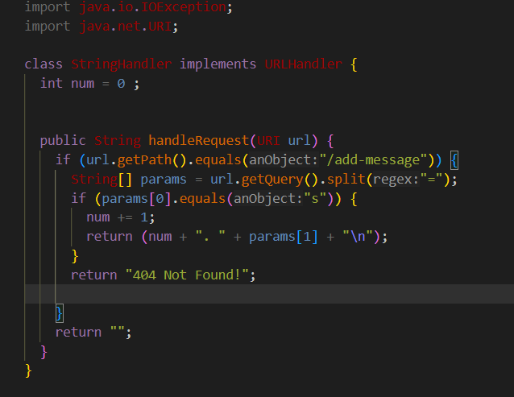

# Lab Report 2 
**Code for my String Server**
---

* The handlerequest method is called.
*  A single argument which is the URI representing the URL
*  The num field is incremented for each request and it represents the amount of messages added.
  ---
  
**Path to Public Key**
* /c/Users/ericb/.ssh/id_rsa.pub
**Path to Private Key**
  */.sssh/authorized_keys
  **Screenshot of Terminal interaction without password **
  
