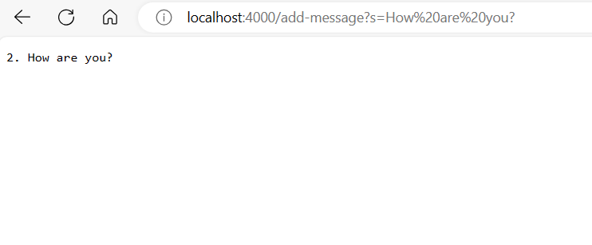

# Lab Report 2 
**Code for my String Server**
***

* The handlerequest method is called.
*  A single argument which is the URI representing the URL
*  The num field is incremented for each request and it represents the amount of messages added.
  ***
  *
  **Screenshots of my String Server; Couldn't get it to store each string**
  
  
  
**Path to Public Key**
* /c/Users/ericb/.ssh/id_rsa.pub
**Path to Private Key**
  */.sssh/authorized_keys
  **Screenshot of Terminal interaction without password**
  
  ***
  This did not work for me, I got it to work in lab and it seemed like it worked here but then it prompted me for a password again.

  **Something I learned in Week 2/3 that I didn't know before**
  * I learned a lot about paths and how to navigate different commands.
  * I also learned how to use commands to double check that I am in the right place.
  * I also learned how to login to a remote terminal and copy files from one to another. 
  
