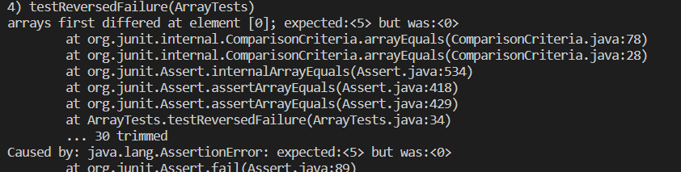

# Lab 3 - Eric Bolander
## Bug to Fix: Reversed Array 
```
# code block failure inducing input:
@Test
  public void testReversedNoFailure() {
    int[] inputArray = {5, 4, 3, 2, 1};
    int[] expectedResult = {1, 2, 3, 4, 5};
    int[] result = YourClass.reversed(inputArray);
    assertArrayEquals(expectedResult, result);
  }
java -cp ".;lib/junit-4.13.2.jar;lib/hamcrest-core-1.3.jar" org.junit.runner.JUnitCore ArrayTests
```

## Failure Inducing output: 


```
# code block success inducing input:

import static org.junit.Assert.assertArrayEquals;
import org.junit.Test;

public class ArrayExamplesTest {

    @Test
    public void testReverseInPlace_Success() {
        int[] arr = {1, 2, 3, 4};
        ArrayExamples.reverseInPlace(arr);
        int[] expected = {4, 3, 2, 1}; // Expected reversed array
        assertArrayEquals(expected, arr);
    }
}
```
## Bug Before the Fix: 
```
static int[] reversed(int[] arr) {
    int[] newArray = new int[arr.length];
    for(int i = 0; i < arr.length; i += 1) {
        arr[i] = newArray[arr.length - i - 1];
    }
    return arr;
}
```
## Bug After Fix: 
```
static int[] reversed(int[] arr) {
    int[] newArray = new int[arr.length];
    for(int i = 0; i < arr.length; i += 1) {
        newArray[i] = arr[arr.length - i - 1];
    }
    return newArray;
}
```
## Explanation: 
 The loop is overwriting the values in the arr array with the reversed values of the newArray. The assignment of variables has to be reversed. 

## Grep Research: 

  1. `grep -r` (or --recursive): Search recursively through directories
     Searches for a pattern within all files "search_term" within the technical directory:
```
     grep -r "parasitic" ./technical
./technical/biomed/1471-2148-1-8.txt:            relationships between free-living and parasitic
./technical/biomed/1471-2148-1-8.txt:            the free-living or the parasitic bacterial cluster,
./technical/biomed/1471-2148-1-8.txt:            parasitic species [ 8 9 ] . Such an operation could be
./technical/biomed/1471-2148-1-8.txt:            parasitic bacteria despite major differences in gene
```
**This command could be useful for finding key terms or focusing your search on a key phrase or cadence.**
     Search and Display Line Numbers that contain the key term "search_term":
```
    grep -rn "parasitic" ./technical
./technical/biomed/1471-2148-1-8.txt:247:            relationships between free-living and parasitic
./technical/biomed/1471-2148-1-8.txt:258:            the free-living or the parasitic bacterial cluster,
```
     
 **This command could be useful for citing a source that you forgot or just simply finding relative information.** 
 **You can also break down huge information sets for key words.** 
 2.  `grep -c` prints count of lines matching criteria
```
     grep -c "parasite" ./technical/biomed/1468-6708-3-1.txt
     0
```

```
grep -c "Cardiovascular" ./technical/biomed/1468-6708-3-1.txt
3
```
  **This could be very useful to find the lines of a text that are very specific**   

 
3.  `grep -v` (or --invert-match): Display non-matching lines
   **This command is useful if there is a tiny piece of information surrounded by lots of info you aren't interested in.**   
     This command shows lines in txt file that excludes the pattern specified:
     ```
grep -v "Cardiovascular" ./technical/biomed/1468-6708-3-1.txt
Introduction
        Older adults are frequently counseled to lose weight,
        even though there is little evidence that overweight is
```

`grep -vc` counts amount of lines that don't match
```
grep -vc "Cardiovascular" ./technical/biomed/1468-6708-3-1.txt
```
 
  
 4. `grep -A n` (or --after-context): Display lines after the matched line
     This command shows the pattern specified, plus the next n lines:
    ```
    grep -A 3 "crash" ./technical/911report/chapter-1.txt
    At 8:46:40, American 11 crashed into the North Tower of the World Trade Center in New York City.

    All on board, along with an unknown number of people in the tower, were killed instantly.
    ```
    ```
    grep -A 0 "crash" ./technical/911report/chapter-1.txt
    At 8:46:40, American 11 crashed into the North Tower of the World Trade Center in New York City
    ```
This command could be very useful for finding what information is surrounding the target info.


# URL Source for all grep research and commands found to try:
https://www.geeksforgeeks.org/grep-command-in-unixlinux/
--


        
 
