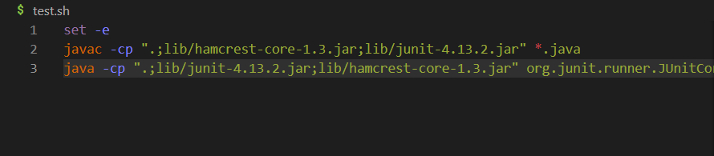
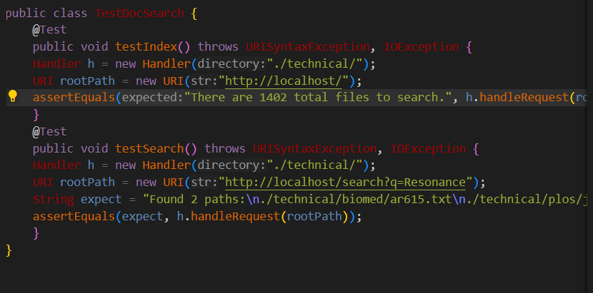
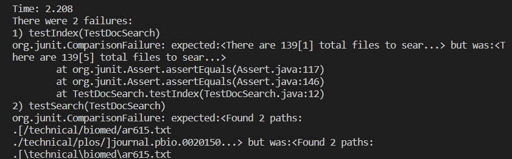
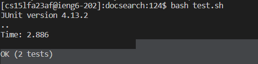
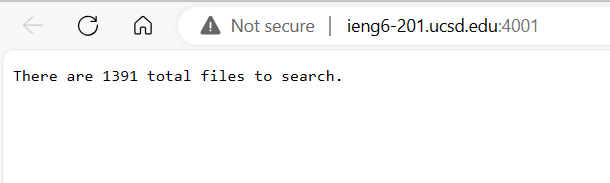

### Title: Test Failures TestDocSearch 
```
Student Post:
Hey Everyone, I am trying to run my test script for TestDocSearch and am getting the output below.

I am pretty sure that I wrote my script correctly, however it seems to be something wrong with the tests themselves?
Here are the tests for DocSearch in the TestDocSearch class:


Here are the error messages I am gettting back:


Here is the test.sh class:


```

```
TA Response:
Hello! Thank you for sharing the details of the bug you are encountering. It looks as if the java file you have downloaded is actually a linux file.
The issue stems from where you are running your tests. 
A question to think about: What are the differences in how to write paths between Linux and Windows?
```

```
Student Response:
Thank you! So the error that I am getting is due to the different slashes associated with the Linux system, does that mean I have to
completely rewrite all the code within the testing class?
```

```
TA Response:
Yes, you are definitely on the right track. When you are thinking about these kind of bugs it is also important to think about
where you are running your code.
Do you think you would get the same error if you tried logging into a remote server?
Try running these commands again, but try using the ssh command to log into IENG first.
```
```
Student Response:
Thank you! It worked, and now my tests work! Thank you.
Tests Working:

Server Running:

```
# Contents of the Directory and files within: 

