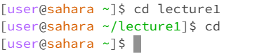
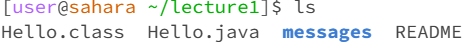
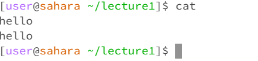
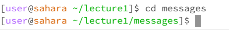
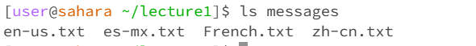
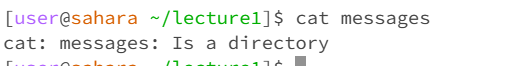
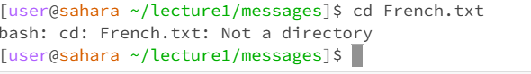
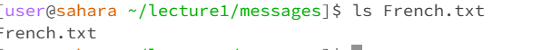
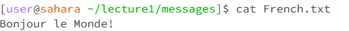

# Eric Bolander 
Professor Politz
Lab 1 - CSE 15L
Today in lab we learned how to navigate different commands within the Ed Workspace. Given a directory through GitHub called lecture 1, we were first able to clone the directory into our workspace using git 
clone command. 
We then used cd, ls, and cat commands to navigate the directory and the files within:
1. Example using these commands with no arguments
   ## cd command: 
   * This command when used from outside of a directory produced no output, however when used from inside the directory took us back out of the directory.
   * Directory - lecture1
   * No errors
 
   ## ls command: 
   * This command listed all the contents of the active directory
   * Directory- lecture1
   * No errors

   ## cat command: 
   * The cat command shows a files contents, so with no command it prompts an input
   * Repeated or reprinted any input given
   * Directory- lecture1
   * No errors
   * Used Ctrl D to stop. 
3.  Example using commands with directory argument
   ## cd: 
    * The cd command with the directory as an argument gave the output expected where it navigated to the directory specified 'messages' and now allows us to access any files inside.
    * Directory- lecture1
    * No errors
   ## ls: 
   * The ls command is a listing command and when used here with messages as an argument it listed all the files inside 'messages'
   * Directory-lecture1
   * no errors 
   ## cat: 
   * The cat command is used for files, so when used with a directory as an argument the output was simply 'lecture1 is a directory'.
   * Directory- lecture1 
5. Example using commands with file argument
   ## cd: 
   * The cd command with the file French.txt as an argument gave the output expected, and gave us an error that says 'not a directory'. This is because the cd command is used to access directories not files.
     * Errors were addressed.
     * Directory - messages
   ## ls: 
   * The ls command is a listing command and when used here with French.txt as the argument, gave us French.txt as output
   * Directory- messages
   * No errors
   ## cat: 
   * The cat command used on a file argument will read the data from that file specified. Here the French.txt file was used so Bonjour monde! was printed.
   * Directory- messages
   * No errors. 
   
