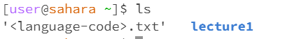

Eric Bolander 
Professor Politz
Lab 1 - CSE 15L
Today in lab we learned how to navigate different commands within the Ed Workspace. Given a directory through GitHub called lecture 1, we were first able to clone the directory into our workspace using git 
clone command. 
We then used cd, ls, and cat commands to navigate the directory and the files within:
1. Example using these commands with no arguments
   cd command: 
   This command produced no output because this command is used to navigate different directories, since there was no directory given the output is nothing.
   No errors.
   ls command: 
   This command produced the output with all the files in the directory that is on the left. In this case there was an error actually because I never deleted the file that I accidentally made outside of
   lecture 1 during lab. The ls command should have just outputed 'lecture1'.
   cat command: 
   The cat command reads data from a file so when used with no argument the output should be blank as it is in the screenshot above.
   No errors. 

3. Example using commands with directory argument
   cd: 
    The cd command with the directory as an argument gave the output expected where it navigated to the directory specified 'lecture1' and now allows us to access any files inside. 
   ls: 
    The ls command is a listing command and when used here with lecture1 as an argument the output was as expected listing all the different files under the lecture1 directory; Hello.java Hello.class
   ReadMe, and messages in bold blue.
   No errors. 
   cat: 
   The cat command is used for files, so when used with a directory as an argument the output was simply 'lecture1 is a directory'. I think this is to be expected because the cat command is reading the data
   from a file.
   No errors. 

5. Example using commands with file argument
   cd: 
   The cd command with the file French.txt as an argument gave the output expected, and gave us an error that says 'not a directory'. This is because the cd command is used to access directories not files.
   Errors were addressed. 
   ls: 
   The ls command is a listing command and when used here with French.txt as the argument, it gave us the expected listed output 'lecture1/messages/French.txt' which is a list of the path to that file.
   No errors. 
   cat: 
   The cat command used on a file argument will read the data from that file specified. Here the French.txt file was used so Bonjour monde! was printed.
   No errors. 
   
