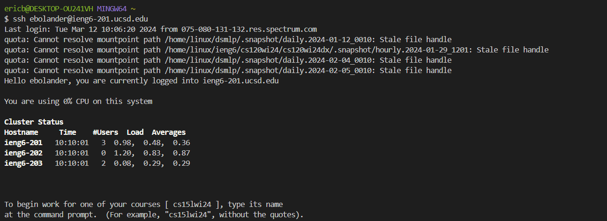
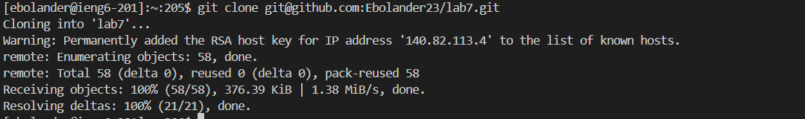
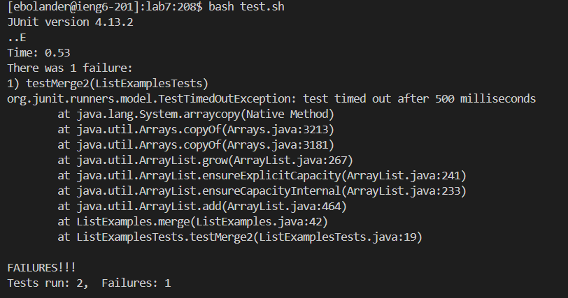
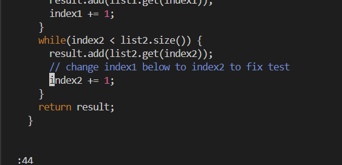
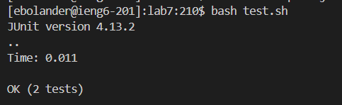
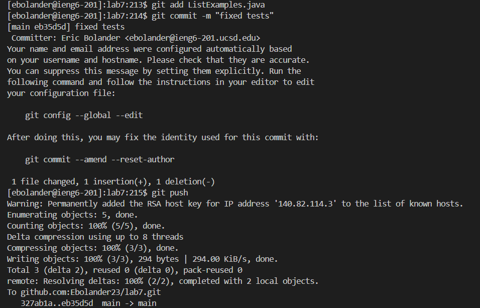

# Lab Report 4 - Vim Steps 4-9
# Eric Bolander
# Dr. Politz

## Step 4: ##
Keys Pressed: `<CTRL -R> <S> <enter>` 
This allowed me to recursively find the `ssh ebolander@ieng6-201.ucsd.edu` command just by typing `s`
**IMPORTANT: Had to access ieng6-201, because JUNIT is not installed on 203. 
 

## Step 5: ## 
Keys Pressed: `<git cl> <tab> <ctrl -v> <enter> ` This allowed me to access the `git clone` command. 
Since I deleted my old fork I had to repaste the new SSH url `git@github.com:Ebolander23/lab7.git`.
`<Tab>` allowed me to skip a few letters. 

## Step 6: ##
Keys Pressed: `<up> <up> <up> <enter>` The `bash test.sh` command in my bash history was only 3 up. 

## Step 7: ##
Keys Pressed: `<vim> <L> <tab> <.java> <enter> <:44> <L> <L> <L> <L> <L> <r> <2> <esc> <:wq> <enter>` 
Since the specific vim command wasn't in my bash history, I used tab to quickly access `ListExamples.java`
Then I used `<:44>` to access the exact line with the error. 
Using `<r>` or `replace` I quickly replaced `index1` with `index 2`. 

## Step 8: ##
Keys Pressed: `<up> <up> <enter>` The `bash test.sh` command was only 2 up in my bash history. 

# Step 9: ## 
Keys Pressed: `<git> <add> <L> <tab> <enter> <git> <co> <tab> <-m> <"fixed"> <enter> <git> <pu> <tab> <enter> 
This one was quicker to just type out then access from my bash history becuase they are such short commands. 

